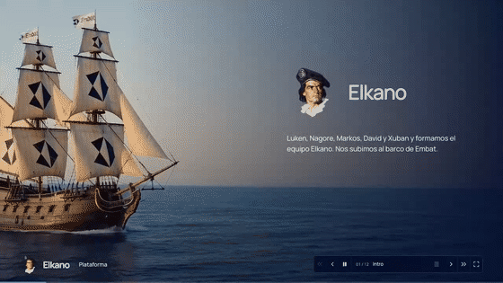
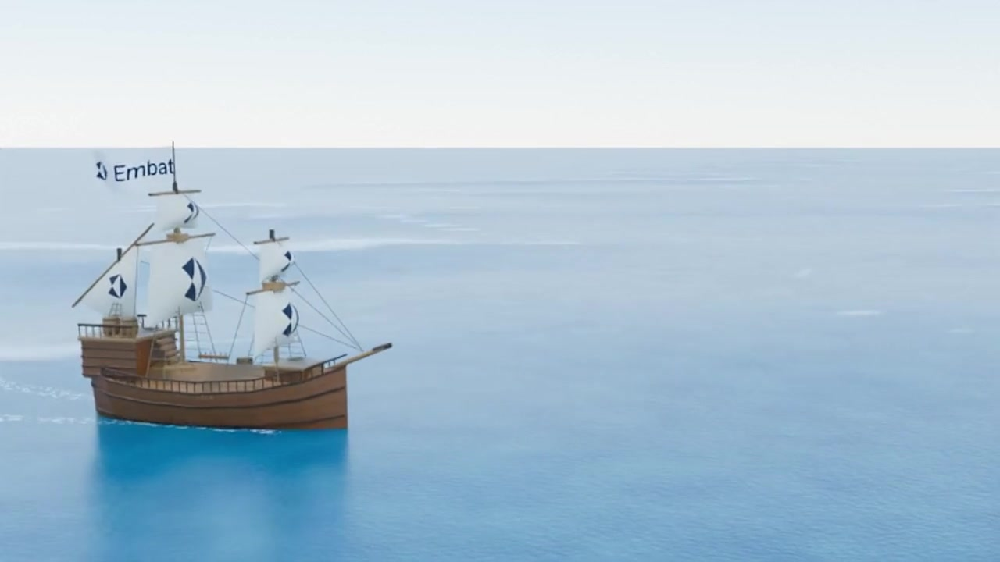
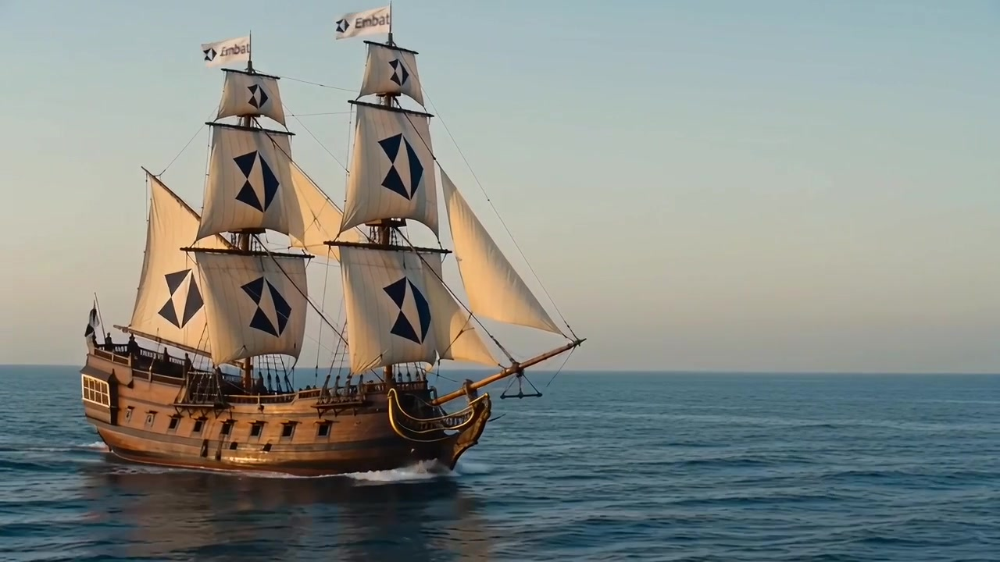

<p align="center">
  <h1 align="center">⛵ El barco de Elkano</h1>
  <p align="center"><strong>De una escena de Blender a una web de cine.</strong><br>Cómo se hizo el barco de la presentación de Elkano en HackSpain 2026</p>
</p>

<p align="center">
  
</p>

<p align="center">
  <a href="https://xubanceccon.substack.com/p/como-se-hizo-la-nave-victoria-en"><strong>Artículo</strong></a>
  &nbsp;&nbsp;|&nbsp;&nbsp;
  <a href="https://elkano-embat-deck.vercel.app/intro/?present=1"><strong>Presentación</strong></a>
  &nbsp;&nbsp;|&nbsp;&nbsp;
  <a href="docs/tutorial.md"><strong>Guía paso a paso</strong></a>
</p>

---

## Qué es

El barco de la presentación no es un vídeo de archivo ni una escena hecha a mano. Salió de tres capas:

| | Capa | Qué hace |
|---|---|---|
| 1 | **Blender + agente** | Astra escribe Python y lo ejecuta dentro de Blender: casco, mástiles, velas con el logo, cámara y movimiento. Sale un MP4 sencillo de referencia. |
| 2 | **Seedance 2.0 en fal.ai** | Toma ese MP4 y el logo, y lo convierte en una toma fotorrealista con la misma composición. |
| 3 | **Web con scroll** | El scroll decide qué instante del vídeo se ve. Los textos y las constelaciones se dibujan encima, en HTML, Canvas y SVG. |

| Referencia de Blender | Resultado de Seedance |
| --- | --- |
|  |  |

El prompt que convirtió el primero en el segundo está en [turning-point-prompt.md](docs/turning-point-prompt.md).

## Cómo arrancar

```bash
git clone https://github.com/EHxuban11/tutorial-barco.git
cd tutorial-barco/hackathon-result/website
npm ci
npm run dev       # http://localhost:4323/intro/?present=1
```

Node 20 o superior. Los vídeos van en el repo, así que no hace falta ninguna clave de fal ni pagar generaciones para verla. La presentación está pensada para pantalla ancha.

## Qué hay en el repo

- [**hackathon-result/**](hackathon-result/): la presentación ejecutable, los vídeos finales, las escenas `.blend` y los scripts de Blender.
- [**prompts/**](prompts/README.md): la secuencia de prompts numerados para hacer tu propia versión.
- [**docs/**](docs/): la [guía paso a paso](docs/tutorial.md), [por qué funciona](docs/why-it-works.md), [cómo se hizo](docs/how-it-was-made.md) y los [prompts originales](docs/audit/README.md) que se enviaron a Seedance.
- [**skills/**](skills/README.md): las skills que usa el agente para repetir el proceso: Blender, fal y la web con scroll.

La documentación detallada está en inglés.

<p align="center"><sub>Luken, Nagore, Markos, David y Xuban · Equipo Elkano · <a href="https://github.com/amarkosmarkos/Elkano_Embat">Repositorio original del hackathon</a></sub></p>
<p align="center"><sub>Las marcas de Embat pertenecen a su propietario. Las fuentes Manrope conservan su licencia OFL.</sub></p>
